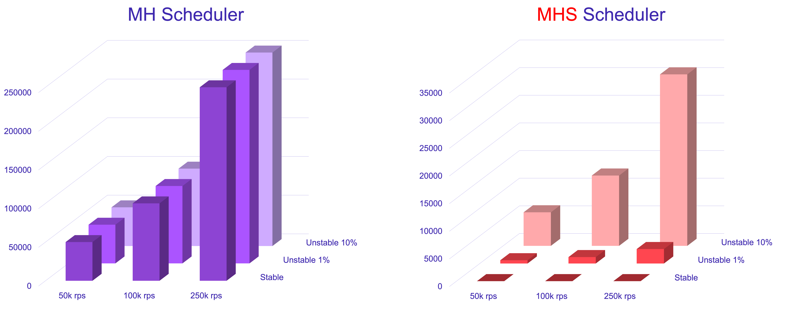
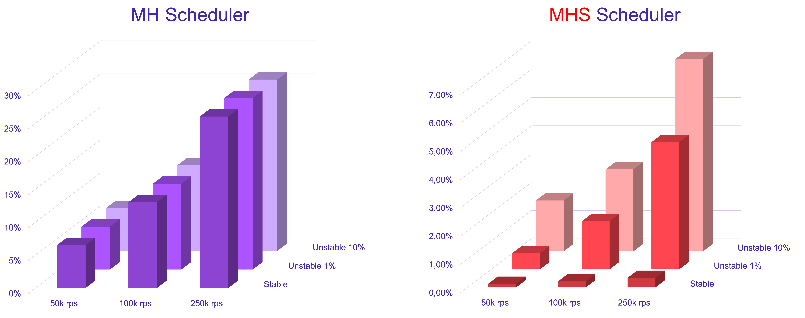
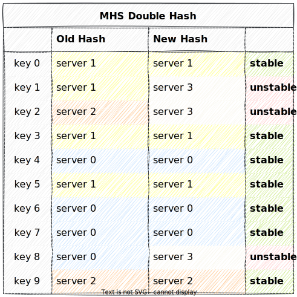
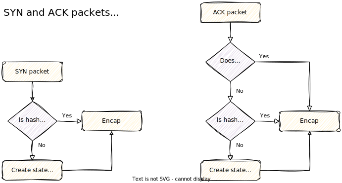

Maglev Hashing Stateless
========================

Introduction
------------

This patch to Linux kernel provides the following changes to IPVS:

* Adds a new type (IP_VS_SVC_F_STATELESS) of scheduler that computes the need for connection entry addition;
* Adds a new mhs (Maglev Hashing Stateless) scheduler based on the mh scheduler that implements a new algorithm (more details below);
* Adds scheduling for ACK packets;
* Adds destination sorting (more details below).

This approach shows a significant reduction in CPU usage, even in the case of 10% of endpoints constantly flapping. It also makes the L4 balancer less vulnerable to DDoS activity. The following results of an experiment display a difference between ordinary mh and mhs in the number of states and CPU usage:

<p align="center", width="100%">
    
</p>

<p align="center", width="100%">
    
</p>

Quick Start
-----------

1. Clone the Linux kernel [repository](https://github.com/torvalds/linux)

2. The last rebase of this patch was over commit `7475e51b87969e01a6812eac713a1c8310372e8a`, so you can do a checkout on it. Apply changes provided by patch to the cloned repository:

```bash
git apply 0001-ipvs-add-a-stateless-type-of-service-and-a-stateless.patch
```

3. Build the Linux kernel with the enabled config option `CONFIG_IP_VS_MHS`, install one, and boot a new kernel containing mhs.

4. Add a new virtual service to IPVS with the mhs scheduler:

```bash
ipvsadm -A -t "$VIP" -s mhs -b flag-1,flag-2
```

Description of a New Algorithm
------------------------------

This patch provides a modified version of the Maglev consistent hashing scheduling algorithm (scheduler mh). It simultaneously uses two hash tables instead of one. One of them is for old destinations, and the other (the candidate table) is for new ones. A hash key corresponds to two destinations, and if both hash tables point to the same destination, then the hash key is called stable; otherwise, it is called unstable.

<p align="center", width="100%">
    
</p>

A new connection entry is created only in the event of an unstable hash key; otherwise, the packet goes through stateless processing. If the hash key is unstable:

* In the case of a SYN packet, it will pick up the destination from the newer (candidate) hash table;

* In the case of an ACK packet, it will use the old hash table.

<p align="center", width="100%">
    
</p>

Upon changing the set of destinations, mhs populates a new candidate hash table and initializes a timer equal to the TCP session timeout. When the timer expires, the candidate hash table value is merged into the old hash table, and the corresponding hash key again becomes stable. If there are changes in the destinations before the timer expires, mhs overwrites the candidate hash table without the timer reset. If the set of destinations is unchanged, the connection tracking table will be empty.

IPVS stores destinations in an unordered way, so the same destination set may generate different hash tables. To guarantee proper generation of the Maglev hash table, the sorting of the destination list was added. This is important in the case of destination flaps, which return the candidate hash table to its original state. This patch implements sorting via simple insertion with linear complexity. However, this complexity may be simplified.
